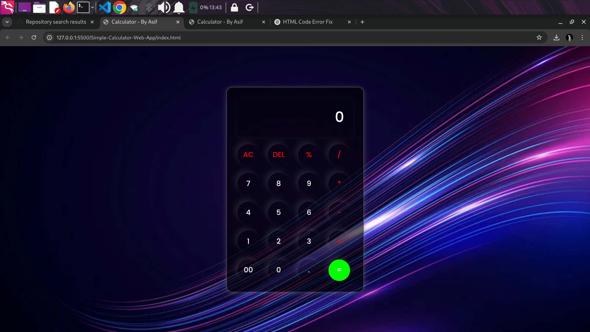

# 🔢 Calculator Web App

A simple and stylish calculator made using **HTML**, **CSS**, and **JavaScript**. Designed with a modern UI and background image support.

## 🚀 Features

- Basic arithmetic operations: `+`, `-`, `*`, `/`, `%`
- Clear (`AC`) and delete (`DEL`) functions
- Input display with live evaluation
- Stylish glassmorphic UI
- Responsive design
- Background image support

## 🛠️ Built With

- HTML5
- CSS3 (Custom Styling + Google Fonts)
- JavaScript (DOM Manipulation)

## 📷 Screenshots

## 📁 Folder Structure
calculator/
├── index.html
├── style.css
├── script.js
├── cal.jpg # Background image
└── screenshot.png # Optional: Screenshot for README

## 🧾 How to Run

1. **Clone or Download** this repository.
2. Make sure all files are in the same directory.
3. Open `index.html` in your web browser.

### 🔁 Or run using Live Server in VS Code

- Install the **Live Server** extension in VS Code.
- Right-click `index.html` → Click **"Open with Live Server"**.

## 🎨 Customization

- Replace `cal.jpg` with any background image you like.
- Update colors and fonts in `style.css` to match your style.

## 🙋‍♂️ Author

**Asif Hussain Tahiri**  
[GitHub Profile](https://github.com/asif922)

⭐ *If you like this project, consider giving it a star!*

